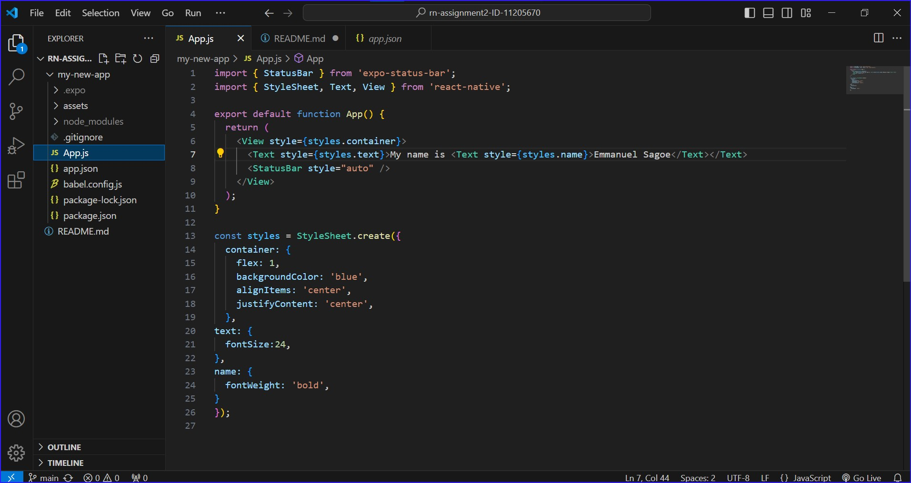

# Student ID: 11205670

# Screenshot

# Description of the task
This task requires that you create a new React Native blank template project using Expo CLI.
Then In the App.js file, you:
- Change the background color of the View component.
- Edit the Text component to display your name.
- Increase the font size of the text to 24.
- Finally make your name bold. 

